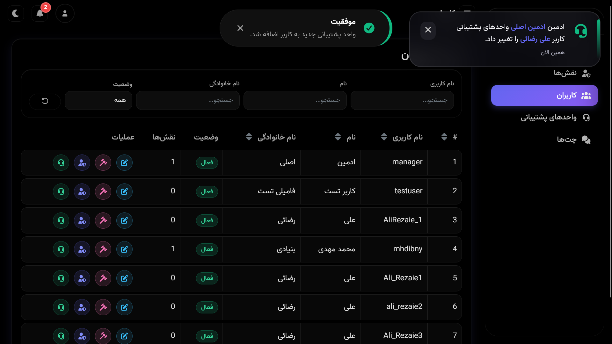
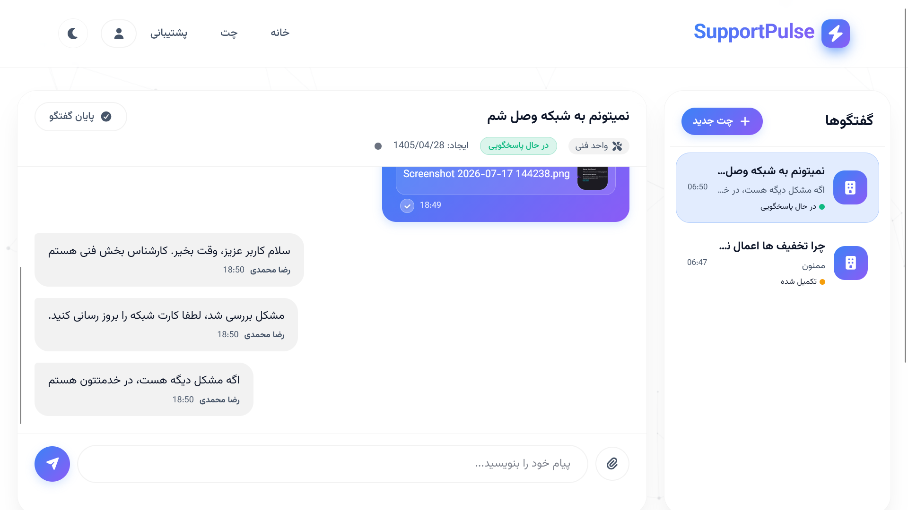
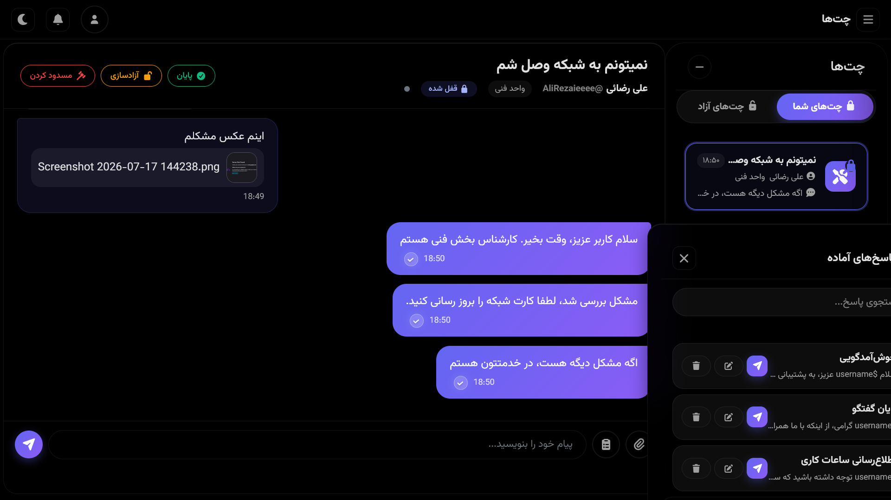

# SupportPulse

<div align="center">


**A fully real‑time help‑desk and live‑support platform where SignalR, security, and fairness come together.**


</div>

## 📑 Quick navigation
| 📌 [Why SupportPulse](#-why-supportpulse) | ⚡ [Key Features](#-key-features) | 🛠️ [Tech Stack](#-tech-stack) |
|---------------------------------------------|------------------------------------|---------------------------------|
| 🚀 [Getting Started](#-getting-started) | 📁 [Project Structure](#-project-structure) | 🧗 [Challenges Solved](#-challenges-solved) |
| 📸 [Screenshots](#-screenshots) | 📜 [License](#-license) | |
---

## 🧠 Why SupportPulse?

I built SupportPulse because I couldn't find a single **open‑source** support system that truly embraced real‑time WebSocket communication end‑to‑end – especially not one that was production‑ready, secure, and adaptable to any organisational chart. In Iran, this gap is even larger.

I had three clear personal goals:

1. **Push SignalR’s security to its limits** – Most WebSocket projects ignore the hard stuff. I wanted to lock down a persistent connection as tightly as a traditional HTTPS request. This meant solving token replay attacks (`Nonce`), instant session invalidation (`SecurityStamp`), and seamless token renewal.

2. **Build a truly real‑time system that outperforms traditional SPAs** – Most modern SPAs still rely on HTTP requests for many operations: creating a role, editing a user, or updating a permission typically involves a round trip to the server and a reactive UI update. I wanted to see what happens when you go all‑in on WebSocket. So I rewrote *everything* – role creation, role editing, user blocking, category management, even notifications – entirely over SignalR. I know it's not the "logical" way to do CRUD, but that's exactly why I did it: it was a fascinating technical challenge I hadn't seen anyone else attempt. The result is a system where every action, no matter how small, is instant and the UI reacts like a local app – zero polling, zero full page loads.

3. **Build a fair, intelligent chat distribution engine** – Round‑robin assignment punishes the best agents. I designed a configurable scoring algorithm that considers free capacity, daily efficiency, and idle time to assign each chat to the most suitable online agent. No more burnout, no more idle hands.

The result is a system where almost every interaction – from sending a message to blocking a user, from locking a chat to receiving a notification – happens in real time over WebSocket. Only Identity endpoints remain as traditional APIs.

---

## 🔥 Key Features

### 🔐 Authentication & Session Management

- **Registration & login** with a custom identity system (JWT API).
- **JWT for WebSocket** connections, **Cookie** auth for the admin dashboard.
- **Silent token auto‑renew** – a tiny JavaScript script refreshes the token one minute before expiration without any user interaction.
- Password hashing with **Argon2id + Pepper** (not BCrypt or SHA).
- **`Nonce` inside JWT** to prevent token replay attacks over WebSocket.
- **`SecurityStamp`** integration – instant session invalidation when a user is banned or their role changes:
  - Custom **middleware** for HTTP requests
  - Custom **HubFilter** for WebSocket connections

---

### 👤 Customer Panel

- Start a new conversation (select a support unit).
- End the chat.
- Send text messages.
- Send files (with or without accompanying text).
- Download files sent by admins.
- **Real‑time indicators**: message seen, admin typing, admin online/offline.

---

### 🛡️ Admin Panel — Fully Real‑time, Fully Granular

#### Roles & Permissions (Fine‑grained)
- Create roles with **operational permissions** (e.g. `BanUser`, `EditRole`) and **notification permissions** (e.g. see when someone else bans a user).
- Edit or delete roles.
- Permissions are designed to match any real‑world org chart – one admin might only be allowed to block users, another only to reply to chats.

#### Support Units (Categories)
- Create units with custom **FontAwesome icons** and descriptions.
- Edit or disable units.
- Units make the system flexible enough to fit any team structure, not the other way around.

#### User Management
- Paginated, filterable user list with **real‑time updates** – if another admin bans a user, you see it instantly.
- **Block/unblock** users:
  - Permanently or time‑based (from 1 minute to years).
  - Always with a **reason** (e.g. “offensive language”) visible to other admins.
  - **Change block status** (permanent → timed or vice‑versa) – each action is controlled by its own permission.
- **Edit user roles** (grant/revoke).
- **Edit user support units** (assign/remove).

#### Real‑time Notification Panel
- With the right permissions, you see every admin event live:
  - *"Admin Reza blocked user Ali"*
  - *"Chat #124 (printer issue) unlocked by Mehdi"*
  - *"New role created"*
- Notifications appear as toasts and are saved in a history panel.

---

### 💬 Chat System — The Heart of SupportPulse

Visible only to users assigned to at least one support unit.

- **Auto‑assignment engine**:
  - Chats are pushed into a **Channel queue** – no waiting.
  - A background service runs the **fair‑distribution scoring algorithm** (weights configurable by system admin) and assigns the chat to the best online agent in that unit.
- **Auto‑unlock**:
  - If the assigned agent doesn't respond within a set time, the chat is automatically unlocked.
  - All online agents in the unit are notified, and the previous agent is blacklisted for that chat so it won't go back to them unless necessary.
- **Manual lock/unlock**:
  - Any agent can lock a free chat.
  - Unlocking with a blacklist – the agent who releases a chat goes into that chat's blacklist; the system tries to assign it to another online agent.
- **End chat** – only the agent who holds the lock.
- **Block user** directly from the chat panel (if permission granted).
- **Real‑time features** (bi‑directional):
  - Typing indicator
  - Online/offline status
  - Message seen/sent status
  - Send and download files

All real‑time operations above run over WebSocket. The only exceptions are a few simple HTTP requests that fetch partial views via JavaScript – everything else is instant and persistent.

---

## 🧰 Tech Stack

- **Backend**: .NET 9 – ASP.NET Core MVC + Web API
- **Real‑time**: SignalR (WebSocket)
- **Database**: SQL Server (latest) + Entity Framework Core 9
- **Password hashing**: Argon2id via `Konscious.Security.Cryptography`
- **Authentication**: JWT + HttpOnly cookies + `Nonce` + `SecurityStamp`
- **Frontend**: Pure vanilla JavaScript – no frameworks. I deliberately avoided any JS framework to dive deep into raw SignalR integration, manage the WebSocket lifecycle by hand, and truly understand the real‑time stack without abstractions.
- **UI**: Bootstrap 5 RTL, FontAwesome 7
- **DevOps**: Docker & Docker Compose (fully containerised)

---

## 🚀 Getting Started

### Prerequisites
- [Docker](https://www.docker.com/) and Docker Compose (for the easy way)
- [.NET 9 SDK](https://dotnet.microsoft.com/download/dotnet/9.0) (for manual setup)


### Quick Start with Docker

```bash
git clone https://github.com/mhdibny/SupportPulse.git
cd SupportPulse

# Copy the example environment file (no editing needed for Docker)
cp .env.example .env       # Linux / macOS / Git Bash
# For Windows PowerShell use: Copy-Item .env.example .env

docker-compose up -d
```

The app is available at:
- Customer panel: `http://localhost:5000`
- Admin panel: `http://localhost:5000/Admin`
- Default admin login: both the username and password are `manager`

> 💡 **Straightforward testing**: To test on a clean address like `http://localhost` (port 80), edit the port mapping in `docker-compose.yml` from `"5000:5000"` to `"80:5000"` before running `docker-compose up`.

### Manual Setup (Development)

```bash
git clone https://github.com/mhdibny/SupportPulse.git
cd SupportPulse
```

Before running the app, open `appsettings.json` and update the connection string inside `ConnectionStrings.SqlServer` so it points to your local SQL Server instance (the default value uses `Server=.;Integrated Security=True` for a local installation).

Copy `.env.example` to `.env` and fill in the required values before running.
```bash
# Apply migrations
dotnet ef database update --project SupportPulse.Data --startup-project SupportPulse.App

# Run
dotnet run --project SupportPulse.App
```

---

## 📁 Project Structure

```
SupportPulse/
├── SupportPulse.Data/       # Models, DbContext, migrations, indexes
├── SupportPulse.Core/        # DTOs, services, business logic, scoring algorithm
├── SupportPulse.App/         # Controllers, Hubs, views, filters, SignalR hubs
└── docker-compose.yml       # Full Docker environment
```

---

## 🧗 Challenges Solved

- **WebSocket security hardening**: `Nonce` + `SecurityStamp` eliminate token replay and hijacking.
- **Fair workload distribution**: Configurable scoring algorithm prevents agent burnout and idle time.
- **Race conditions in chat locking**: `SemaphoreSlim` per support unit so two admins can't lock the same chat simultaneously.
- **Database performance**: Notifications go into a `Channel`, persisted by a background service – zero extra delay for the main request flow.
- **Pure SignalR architecture**: Almost every action is real‑time; only Identity remains REST, reducing complexity and latency.
- **Going all‑in on real‑time admin operations**: Implementing every admin action (role management, user moderation, category updates) over SignalR was technically challenging and taught me a ton about optimistic UI, conflict handling, and hub design at scale.

---


## 📸 Screenshots
| Admin Dashboard | User Chat | Admin Chat View |
|-----------------|-----------|-----------------|
|  |  |  |
---

## 📜 License

SupportPulse is open‑source under the [MIT License](LICENSE).

---

## 📬 Get in touch

- Email: MMBonyadi@outlook.com
- GitHub: [mhdibny](https://github.com/mhdibny)
